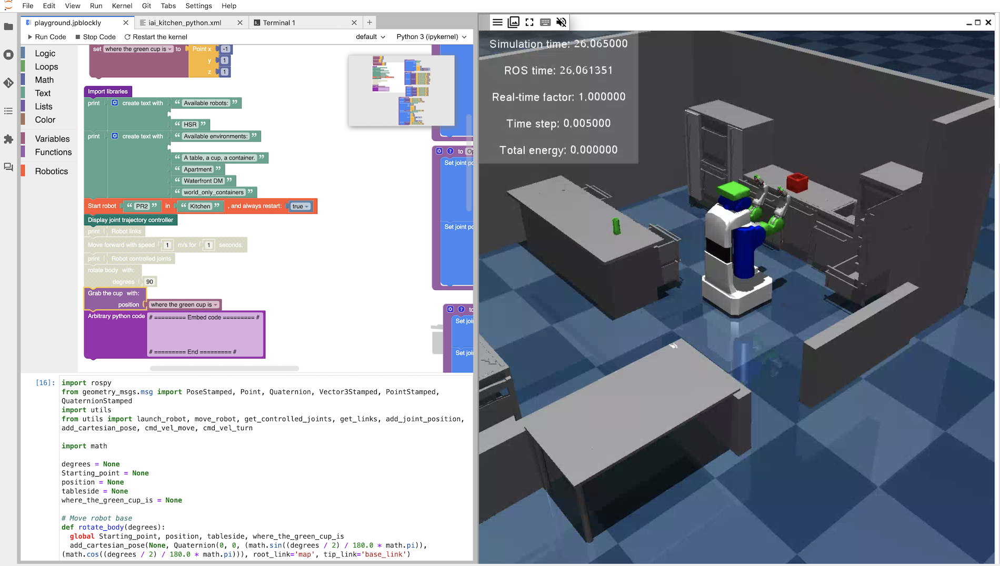

# blockly-playground

[](https://binder.intel4coro.de/v2/gh/IntEL4CoRo/blockly-playground.git/main?urlpath=lab/tree/examples/playground.jpblockly)

Block-based programming for household robots.



Examples on Binderhub:
- https://binder.intel4coro.de/v2/gh/IntEL4CoRo/blockly-playground.git/main?urlpath=lab/tree/examples/playground.jpblockly

<!-- - PR2: https://binder.intel4coro.de/v2/gh/IntEL4CoRo/blockly-playground.git/main?labpath=examples/pr2.jpblockly -->
<!-- - HSR: https://binder.intel4coro.de/v2/gh/IntEL4CoRo/blockly-playground.git/main?labpath=examples/hsr.jpblockly -->

## Software Components

### Blockly

Blockly is a library from Google for building beginner-friendly block-based programming languages.

Docs: https://developers.google.com/blockly/guides/overview

Repo: https://github.com/google/blockly

### Giskardpy

Giskard is an open source motion planning framework for ROS, which uses constraint and optimization based task space control to generate trajectories for the whole body of mobile manipulators.

Repo: https://github.com/SemRoCo/giskardpy/tree/mujoco_actions_devel

### Mujoco (2.3.7) simulator

MuJoCo stands for Multi-Joint dynamics with Contact. It is a general purpose physics engine that aims to facilitate research and development in robotics, biomechanics, graphics and animation, machine learning, and other areas which demand fast and accurate simulation of articulated structures interacting with their environment.

Repo: https://github.com/HoangGiang93/mujoco_sim


## Development

### Build Docker Image Locally (Under repo directory)

- Run Docker image with X-forwarding

  ```bash
  xhost +local:docker && \
  docker compose -f ./binder/docker-compose.yml up  --build && \
  xhost -local:docker
  ```

- Open Web browser and go to http://localhost:8888/lab/

- To stop and remove container:

  ```bash
  docker compose -f ./binder/docker-compose.yml down
  ```
